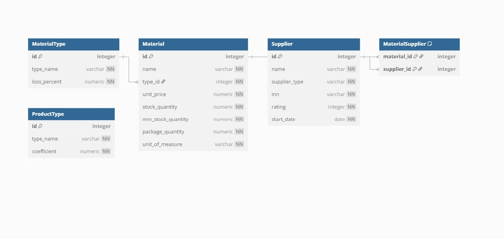

### README.md
 

# Материальный калькулятор и складской учёт

Это Flask-приложение для управления материалами, расчёта минимальных партий заказа и определения количества производимой продукции.

## Основные функции

1. **Главная страница**
   - Просмотр всех материалов с текущим запасом
   - Автоматический расчёт минимальной партии заказа
   - Отображение стоимости минимального заказа

2. **Управление материалами**
   - Добавление новых материалов
   - Редактирование существующих материалов
   - Просмотр поставщиков для каждого материала

3. **Калькулятор продукции**
   - Расчёт количества продукции, которое можно произвести
   - Учёт потерь сырья при производстве
   - Отображение деталей расчёта

## Требования

- Python 3.9+
- Зависимости: `pip install -r requirements.txt`

## Запуск приложения

1. Склонируйте репозиторий:
```bash
git clone https://github.com/Bogdan2005-criater/Mitchenko-Bogdan-Sergeevich-K4I1-9--06.12.2005.git
```

2. Установите зависимости:
```bash
pip install -r requirements.txt
```

3. Запустите приложение:
```bash
python app.py
```

4. Откройте в браузере:
```
http://localhost:8080/
```

## Структура проекта

```
├── app.py                 # Основное приложение Flask
├── configs.py              # Конфигурация базы данных
├── model.py               # Модели базы данных
├── bd_insert.py           # Инициализация БД
├── calculator_of_product.py  # Логика расчёта продукции
├── requirements.txt       # Зависимости
└── basedata.sqlite3       # База данных
└── data/                  # Папка с исходными данными (Excel-файлы)
└── statics/               # Статические файлы 
└──── icon.ico             # Логотип для вкладки
└──── icon.png             # Логтип для главной страницы
└──── style.css            # Стили для html
└── templates/             # Весь Html код
└──── base.html            
└──── calculator_of_product.html
└──── form_material.html
└──── index.html
└──── suppliers_material.html
```

## Инициализация базы данных

При первом запуске автоматически создаётся база данных и заполняется тестовыми данными из Excel-файлов в папке `data/`.

Необходимые файлы:
- `Material_type_import.xlsx`
- `Product_type_import.xlsx`
- `Suppliers_import.xlsx`
- `Materials_import.xlsx`
- `Material_suppliers_import.xlsx`

## Особенности реализации

1. **Расчёт минимальной партии**
   ```python
   if stock < min_stock:
       deficit = min_stock - stock
       packages = ceil(deficit / package_qty)
       min_order = packages * package_qty
       cost = min_order * unit_price
   ```

2. **Расчёт продукции**
   ```python
   material_per_unit = param1 * param2 * coefficient
   required_per_unit = material_per_unit / (1 - loss_percent)
   product_count = raw_amount / required_per_unit  # с округлением вниз
   ```

3. **Валидация данных**
   - Проверка отрицательных значений
   - Контроль уникальности наименований
   - Проверка корректности типов данных

## Используемые технологии

- Python 3
- Flask (веб-фреймворк)
- SQLite (база данных)
- Pandas (импорт данных из Excel)
- Jinja2 (шаблонизация)
